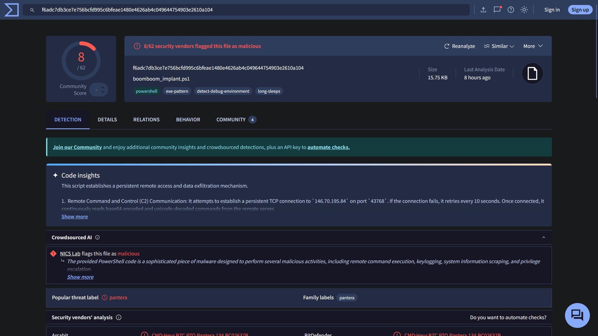
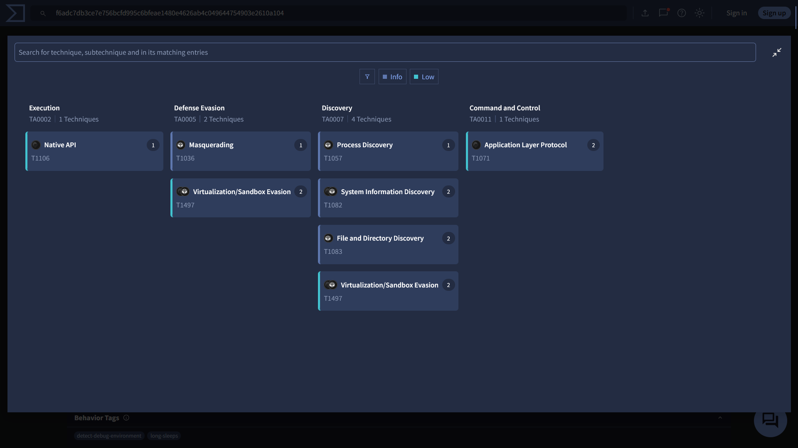
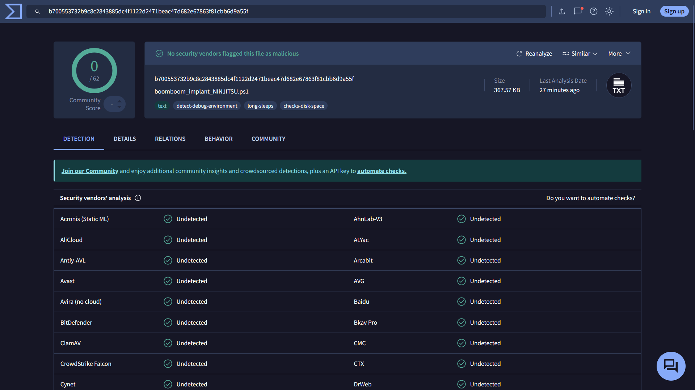
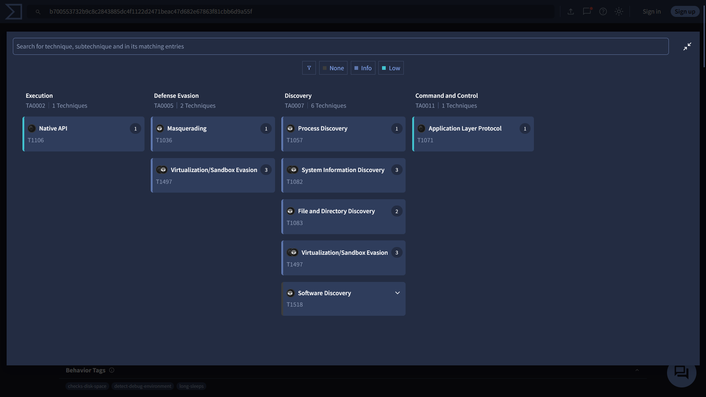

<div align="center">
  <h1>Noseeum</h1>
  <p><b>A UNIFIED FRAMEWORK FOR UNICODE-BASED EXPLOITATION</b></p>

  
</div>

<div align="center">

  
  &nbsp;
  
  &nbsp;
  
  &nbsp;
  

</div>

<p align="center">
  <a href="#overview">Overview</a> •
  <a href="#features">Features</a> •
  <a href="#installation">Installation</a> •
  <a href="#basic-usage">Usage</a> •
  <a href="#security-improvements">Security</a> •
  <a href="#performance-improvements">Performance</a> •
  <a href="#development">Development</a> •
  <a href="#package-structure">Structure</a>
</p>

<hr>

## OVERVIEW

**Noseeum** is a modular offensive security framework designed for executing Unicode-based attacks. This tool consolidates a range of advanced obfuscation and exploitation techniques into a single, extensible command-line interface. It is built for precision, power, and operational security.

**Primary Function:** Execute Unicode smuggling attacks including Trojan Source, homoglyph substitution, and invisible character encoding to hide malicious code in plain sight.

**Technology Stack:**
- Python 3 for core implementation
- Unicode control characters for attack vectors
- Modular architecture with pluggable attack modules
- Command-line interface powered by Click
- Cross-platform compatibility

`Noseeum` prioritizes `precision`, `stealth`, and `operational security` in Unicode-based exploits.

## NOSEEUM IN ACTION

Below is a screencap of the VirusTotal analysis of the unencoded powershell malware (BEFORE processing with `noseeum`) as well as its "MITRE ATT&CK Tactics and Techniques" Chart  
+ **NOTE THE `8/62` DETECTION RATE**
+ HASH = `f6adc7db3ce7e756bcfd995c6bfeae1480e4626ab4c049644754903e2610a104`


</div>


</div>

Below is a screencap of the VirusTotal analysis of the `Zero Width Character`-encoded powershell malware (AFTER processing with `noseeum`) as well as its "MITRE ATT&CK Tactics and Techniques" Chart 
+ **NOTE THE `0/62` DETECTION RATE**
+ HASH = `b700553732b9c8c2843885dc4f1122d2471beac47d682e67863f81cbb6d9a55f`


</div>


</div>  

## FEATURES

### Unified Command-Line Interface
Noseeum provides a single, clean command-line interface powered by Python's `click` library.

- **Modular Architecture**: Each attack vector is a self-contained module, allowing for rapid development and integration of new exploits.
- **Multiple Attack Vectors**:
    - **Bidi (Trojan Source)**: Make malicious code appear as harmless comments.
    - **Homoglyph**: Evade signature-based detection and confuse human analysts by substituting characters with visually identical ones.
    - **Invisible Ink**: Hide payloads steganographically within benign text or generate imperceptible prompts to jailbreak LLMs.
    - **File Steganography**: Encode entire files as zero-width character sequences and decode them back.
    - **Language-Specific Exploits**: Target unique weaknesses in Python, JavaScript, and Java.
- **Globally Installable**: Can be installed as a system-wide command-line tool using pip.

### Enhanced Security Measures
The framework includes several security enhancements:

- **Safe Code Execution**: The `exec()` vulnerability in glassworm has been replaced with safer AST-based validation and restricted namespaces.
- **Path Validation**: Directory traversal attacks are prevented with proper path validation.
- **Input Sanitization**: Payloads are now sanitized to prevent injection attacks.
- **Encoding Detection**: Automatic encoding detection prevents issues with different file encodings.

### Performance Optimizations
- **Registry Caching**: The homoglyph registry is now cached to avoid repeated file loading.
- **Efficient Processing**: Improved string processing algorithms for faster execution.
- **Configurable Settings**: Centralized configuration for optimized parameters.

### Detection and Scanning Module
Includes a scanner to identify the presence of these same Unicode smuggling vulnerabilities in source code.

- **File Vulnerability Scanning**: Scan individual files for Unicode smuggling vulnerabilities
- **Multi-Language Support**: Detect vulnerabilities across Python, JavaScript, Java, and other languages
- **Comprehensive Detection**: Identifies various types of Unicode exploits including Bidi, homoglyphs, and invisible characters

## INSTALLATION

### Global Installation (Recommended)

Noseeum can be installed as a globally accessible command-line tool:

1. **Clone the repository:**
    ```bash
    git clone <repository_url>
    cd noseeum
    ```

2. **Install required data files:**
    Before using the framework, you need to generate the required registry files:
    ```bash
    python3 create_registry.py      # Creates homoglyph_registry.json
    python3 create_nfkc_map.py      # Creates nfkc_map.json
    ```

3. **Install the package:**
    ```bash
    pip install .
    ```
    or using the Makefile:
    ```bash
    make install
    ```

This will install the `noseeum` command globally on your system, making it accessible from any directory.

### Uninstallation

To remove the globally installed package:
```bash
make uninstall
```

## BASIC USAGE

All functionality is accessed through the `noseeum` command.

**View all available commands:**
```bash
noseeum --help
```

**View attack-specific commands:**
```bash
noseeum attack --help
```

**Scan a file for vulnerabilities:**
```bash
noseeum detect --file /path/to/your/file.js
```

For a complete breakdown of every command, option, and argument, refer to the [**USAGE.md**](./docs/USAGE.md) document.

## SECURITY IMPROVEMENTS

The framework has been enhanced with several security measures:

- **Safe Code Execution**: The `exec()` vulnerability in glassworm has been replaced with safer AST-based validation and restricted namespaces.
- **Path Validation**: Directory traversal attacks are prevented with proper path validation.
- **Input Sanitization**: Payloads are now sanitized to prevent injection attacks.
- **Encoding Detection**: Automatic encoding detection prevents issues with different file encodings.

## PERFORMANCE IMPROVEMENTS

- **Registry Caching**: The homoglyph registry is now cached to avoid repeated file loading.
- **Efficient Processing**: Improved string processing algorithms for faster execution.
- **Configurable Settings**: Centralized configuration for optimized parameters.

## DEVELOPMENT

This project uses a `Makefile` to streamline common development tasks.

-   **`make install`**: Sets up the development environment, installs dependencies from `requirements.txt`, creates required data files, and installs the `noseeum` package in editable mode.
-   **`make uninstall`**: Removes the `noseeum` package from your system.
-   **`make clean`**: Deletes all build artifacts, such as `build/`, `dist/`, and `.egg-info/` directories.

## PACKAGE STRUCTURE

The framework is organized as follows:
- `noseeum/`: Main Python package containing:
  - `attacks/`: Individual modules for each attack vector
  - `detector/`: Scanning and detection functionality
  - `utils/`: Helper utilities and error handling
  - `data/`: Embedded data files (homoglyph_registry.json, nfkc_map.json)
- `create_registry.py`: Script to generate the homoglyph registry
- `create_nfkc_map.py`: Script to generate the NFKC mapping
- `smuggler.py`, `glassworm.py`, `smuggler_dropper.py`: Standalone scripts with specific attack techniques
